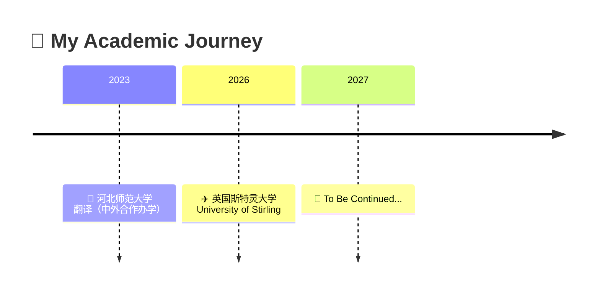

  

  

---

### 🧸 About Me / 关于我

- 🎓 河北师范大学 翻译（中外合作办学）2023级本科生
- ✈️ 2026年9月赴 **英国斯特灵大学** 交换学习一年
- 📖 热爱语言、技术与跨文化交流
- 💡 善于用 AI 工具提升翻译效率，用代码解决实际问题
- 🌱 正在探索 AI + 翻译的无限可能

---

### 🗺️ Education / 教育经历

| 📅 时间 | 🏫 学校 | 📚 专业 |
| :---: | :---: | :---: |
| 2023 - 2026 | 河北师范大学 | 翻译（中外合作办学） |
| 2026 - 2027 | University of Stirling | Translation & Interpreting |

---

### 🛠️ Skills / 技能工具箱

  
  
  
  

  
  
  
  
  
  

> 🔥 **擅长方向：** 用 AI 工具编写脚本、制作网页、辅助翻译工作，让技术为语言服务赋能。

---

### 🚀 Projects / 项目展示

*📌 更多项目正在路上，敬请期待～*

| 🛠️ Project | 📝 Description | 🏷️ Tech |
| :---: | :--- | :---: |
| ✨ *Coming Soon* | 项目一：待更新 | - |
| ✨ *Coming Soon* | 项目二：待更新 | - |
| ✨ *Coming Soon* | 项目三：待更新 | - |

---

### 📊 GitHub Stats / 统计面板

  
  

  

---

### 📫 Connect With Me / 与我联系

  
  

  <i>📬 欢迎交流与合作！Feel free to reach out!</i>

---

  

<!--
  ⭐️ 提示：把上面所有的 `Waterc0lorEyes` 替换成你的真实 GitHub 用户名
  项目部分可以随时更新，添加更多内容~
-->
